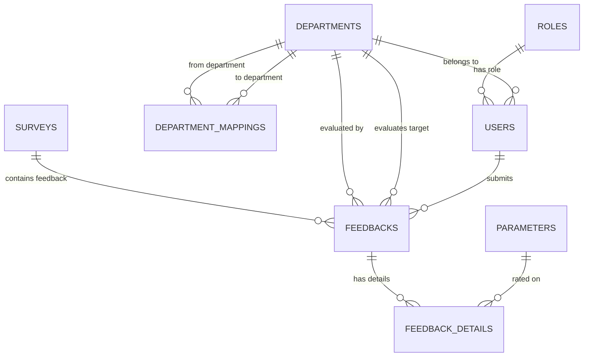

# User Satisfaction Index (USI) Rating Server Backend Documentation

Welcome to the official developer and architecture documentation for the **User Satisfaction Index (USI) Rating Server**. This backend application is a robust, modular, and enterprise-ready rating engine designed to facilitate inter-departmental satisfaction evaluations within an organization.

---

## 1. Project Overview

The **User Satisfaction Index (USI) Rating Server** is a backend application developed in Node.js and Express.js, utilizing MySQL as the relational storage layer. The primary goal of the system is to calculate and track departmental performance and mutual satisfaction scores within an organization. 

Rather than standard top-down or customer-facing rating engines, this system maps B2B-style internal relations (e.g., how well the **IT Department** supports the **HR Department** or how responsive **Finance** is to **Operations**).

### Purpose of the Backend
The backend serves as the core engine that:
1. Enforces business validation rules (such as preventing a department from reviewing itself or ensuring that only active surveys accept responses).
2. Manages department evaluation permissions (mappings).
3. Safely records feedback entries.
4. Calculates weighted satisfaction index ratings based on custom parameter weights.
5. Serves analytical dashboards and generates binary report exports (Excel spreadsheets and PDF summaries).

### Major Features
* **Role-Based Access Control (RBAC):** Restricts system administration tasks (such as CRUD on users, surveys, parameters, and mappings) to the **Admin** role, and feedback entry to the **HOD (Head of Department)** role.
* **Dynamic Parameter Weighting:** Evaluates departments based on core metrics (Responsiveness, Proactiveness, Professionalism, Domain Expertise, Communication, and Continuous Improvement) with weight percentages that total 100%.
* **Closed-Loop Survey Sessions:** Supports draft, active, and completed survey cycles, allowing HODs to save progress as drafts and finalize them before the deadline.
* **Strict Schema Triggers:** Enforces triggers at the database layer to maintain database integrity (e.g., ensuring only one active HOD exists per department).
* **Document Exporters:** Generates Excel spreadsheets of department averages and detailed performance PDF summaries on demand.

---

## 2. Technology Stack

| Technology | Purpose & Rationale |
| :--- | :--- |
| **Node.js** | Used for its asynchronous, event-driven runtime environment, which handles concurrent client connections efficiently. |
| **Express.js** | A minimal and flexible web application framework that manages routing, request parsed payloads, and handles global application errors cleanly. |
| **MySQL (v8.0+)** | Relational database management system chosen to ensure strict structural integrity, transact validation consistency, and support performance-optimised triggers and indices. |
| **JWT (jsonwebtoken)** | Enables stateless, secure authentication. Tokens are signed by the server and validated by route guards, eliminating the need to maintain user sessions in memory. |
| **bcryptjs** | A password-hashing function incorporating salt-generation to secure stored credentials against rainbow table and brute-force attacks. |
| **exceljs** | Programmatic Excel spreadsheet builder used to format, style, auto-fit, and stream ratings tables to clients. |
| **pdfkit** | A PDF document generation library used to draw vector borders, style tabular data, handle pagination, and render performance reports. |

---

## 3. Folder Structure

```text
Rating_Server/
├── src/
│   ├── app.js                          # Express application initialization
│   ├── server.js                       # HTTP server entry point and DB checker
│   ├── config/
│   │   └── db.js                       # Connection pool setup
│   ├── constants/
│   │   └── roles.js                    # Access control values
│   ├── middlewares/
│   │   ├── auth.middleware.js          # JWT Verification
│   │   ├── error.middleware.js         # Unified error mapping
│   │   └── role.middleware.js          # Route authorization checks
│   ├── database/
│   │   ├── schema.sql                  # Database tables and triggers
│   │   └── seed.sql                    # Initial master data
│   ├── utils/
│   │   ├── ApiError.js                 # Unified error envelope
│   │   ├── ApiResponse.js              # Standardized API response
│   │   ├── bcrypt.js                   # Hashing utility
│   │   ├── excel.js                    # Spreadsheet exporter
│   │   ├── jwt.js                      # Token utilities
│   │   └── pdf.js                      # PDF layout helper
│   ├── repositories/
│   │   ├── dashboard.repository.js     # Analytics raw SQL queries
│   │   ├── department.repository.js    # Departments table access
│   │   ├── departmentMapping.repository.js # Review permissions table access
│   │   ├── feedback.repository.js      # Feedback submission table access
│   │   ├── feedbackDetail.repository.js # Individual rating access
│   │   ├── parameter.repository.js     # Score parameters table access
│   │   ├── role.repository.js          # Roles table access
│   │   ├── survey.repository.js        # Active surveys table access
│   │   └── user.repository.js          # Users and HOD table access
│   ├── services/
│   │   ├── auth.service.js             # Sign-in and credentials logic
│   │   ├── dashboard.service.js        # Metrics calculation logic
│   │   ├── department.service.js       # Department validation logic
│   │   ├── departmentMapping.service.js # Evaluation eligibility checking
│   │   ├── feedback.service.js         # Submission locks and calculations
│   │   ├── parameter.service.js        # Parameter weight checks
│   │   ├── report.service.js           # Binary buffer compilers
│   │   ├── survey.service.js           # Survey lifecycle checks
│   │   └── user.service.js             # Password hashing and CRUD rules
│   ├── controllers/
│   │   ├── auth.controller.js          # Authentication handler
│   │   ├── dashboard.controller.js     # Dashboard endpoints handler
│   │   ├── department.controller.js    # Department request router target
│   │   ├── departmentMapping.controller.js # Mappings request router target
│   │   ├── feedback.controller.js      # HOD feedback handler
│   │   ├── parameter.controller.js     # Parameter request handler
│   │   ├── report.controller.js        # Document download handler
│   │   ├── survey.controller.js        # Survey management handler
│   │   └── user.controller.js          # User administration handler
│   └── routes/
│       ├── index.js                    # Combined router entry
│       ├── auth.routes.js              # Credentials endpoints
│       ├── dashboard.routes.js         # Analytics endpoints
│       ├── department.routes.js        # Department CRUD endpoints
│       ├── departmentMapping.routes.js # Mapping CRUD endpoints
│       ├── feedback.routes.js          # Evaluation submissions endpoints
│       ├── parameter.routes.js         # Weight parameters endpoints
│       ├── report.routes.js            # File download endpoints
│       ├── survey.routes.js            # Surveys CRUD endpoints
│       └── user.routes.js              # User CRUD endpoints
├── tests/
│   ├── unit/                           # Isolated business tests (Unit)
│   └── integration/                    # Route-level end-to-end tests (Integration)
├── logs/                               # Output log directory
├── uploads/                            # Binary attachments directory
├── .env                                # Local environment configurations
├── .env.example                        # Configurations template
├── .gitignore                          # Untracked items
├── nodemon.json                        # Development hot-reloader config
└── package.json                        # Scripts and dependencies
```

---

## 4. Folder Explanation

### `src/config`
Contains files related to external system configurations and connections.
* **`db.js`**
  - Configures the MySQL connection pool utilizing values fetched from environment variables (`DB_HOST`, `DB_USER`, etc.).
  - Exports a promise-enabled `pool` object allowing modern async/await query execution.
  - Implements a verification connection test method (`connectDB`) invoked during application startup.
* **`jwt.js`** (Migrated to `src/utils/jwt.js`)
  - Handles key configurations for token verification and creation (relocated to utilities for structural alignment).
* **`app.config.js`** (Extension Placeholder)
  - Dedicated configuration file for custom app limits, session details, and default timeouts.
* **`logger.js`** (Extension Placeholder)
  - Dedicated logging configuration file to manage server stream logs.

---

### `src/routes`
Acts as the request entry-point mapping URL paths to matching controller methods.
* **`index.js`**
  - Binds all separate route scripts (auth, users, surveys, parameters, feedbacks, reports, dashboards) into a unified master router prefixed with `/api/v1`.
* **`auth.routes.js`**
  - Defines the `/auth/login` sign-in route.
* **`user.routes.js`**
  - Exposes User administration endpoints (GET, POST, PUT, DELETE). Restricted to `Admin` users.
* **`department.routes.js`**
  - Maps Department endpoints. Read actions are available to HODs and Admins; create/edit actions are restricted to `Admin` users.
* **`departmentMapping.routes.js`**
  - Exposes mappings management. Contains a HOD-level endpoint `/my-targets` to let users discover departments they need to review.
* **`survey.routes.js`**
  - Handles survey CRUD. Exposes `/active` for HODs to fetch the current active survey.
* **`parameter.routes.js`**
  - Configures parameters endpoints. Read functions are visible to HODs; configuration overrides are Admin-only.
* **`feedback.routes.js`**
  - Manages feedback operations. POST `/` allows HODs to save a draft or submit final scores. `/status` and `/details` assist HODs with feedback checklists.
* **`dashboard.routes.js`**
  - Serves statistics `/summary`, `/department-analytics`, detailed reports, and cross-tabulation `/matrix`.
* **`report.routes.js`**
  - Streams compiled document buffers for Excel (`/excel`) and PDF (`/pdf`) reports.

---

### `src/controllers`
Handles incoming Express request payloads, validates input existence, calls service business layers, and compiles the standardized HTTP API response.
* **`auth.controller.js`**
  - Collects credentials from `req.body`, calls the authentication service, and returns the signed token.
* **`user.controller.js`**
  - Manages requests to list, create, update, or delete users.
* **`department.controller.js`**
  - Manages requests to create, inspect, modify, or remove departments.
* **`departmentMapping.controller.js`**
  - Manages requests for evaluation eligibility mappings.
* **`survey.controller.js`**
  - Manages requests to manage periodic survey sessions.
* **`parameter.controller.js`**
  - Manages requests to modify weighted evaluation metrics.
* **`feedback.controller.js`**
  - Coordinates feedback submissions. Intercepts `req.user` to track the evaluator's department and credentials.
* **`dashboard.controller.js`**
  - Interfaces with the analytics layer to return numeric data matrices.
* **`report.controller.js`**
  - Set response headers (MIME types, file attachments) and streams output binaries to the client.

---

### `src/services`
Contains all business logic, checks entity dependencies, and enforces validations. Controllers call these services, separating routing from calculations.
* **`auth.service.js`**
  - Verifies credentials against hashed database records and returns signed payload tokens.
* **`user.service.js`**
  - Hashes passwords during user registration and restricts HOD role mapping depending on trigger checks.
* **`department.service.js`**
  - Ensures department codes remain unique and validates status fields.
* **`departmentMapping.service.js`**
  - Confirms evaluator/evaluatee departments exist and prevents self-evaluation mappings.
* **`survey.service.js`**
  - Ensures active dates do not conflict and restricts operations to one active survey session at a time.
* **`parameter.service.js`**
  - Ensures active parameter weight percentages sum exactly to 100%.
* **`feedback.service.js`**
  - Restricts rating inputs between 1 and 5. Checks mapping permissions, ensures the survey is active, and locks records upon final submission.
* **`dashboard.service.js`**
  - Aggregates metrics and computes weighted averages.
* **`report.service.js`**
  - Builds tables and feeds rows into formatting utility buffers.

---

### `src/repositories`
Interacts directly with the database using raw SQL queries. Ensures database operations are decoupled from business logic.
* **`role.repository.js`**
  - Runs queries on the `roles` table.
* **`user.repository.js`**
  - Runs queries on the `users` table. Includes joins on roles and departments.
* **`department.repository.js`**
  - Runs query operations on the `departments` table.
* **`departmentMapping.repository.js`**
  - Fetches review target permissions between departments.
* **`survey.repository.js`**
  - Manages active, draft, and closed survey records.
* **`parameter.repository.js`**
  - Reads and updates score parameters and their weights.
* **`feedback.repository.js`**
  - Manages main evaluation records, including submission timestamps.
* **`feedbackDetail.repository.js`**
  - Operates on detail lines containing ratings per parameter. Uses duplicate-key upserts for saving drafts.
* **`dashboard.repository.js`**
  - Executes database aggregates and math (e.g. weighted score index calculation) directly in MySQL.

---

### `src/models` (Conceptual / Entity Schema)
Since the server uses a raw SQL repository architecture, separate model files (like ORM files) are replaced by tables in SQL. Conceptually, the model representations are:
* **`Role`**: Represents the roles table defining authorization levels (`Admin`, `HOD`, `User`).
* **`User`**: Represents user accounts with hashed credentials and role/department links.
* **`Department`**: Represents structural divisions inside the organization (e.g., HR, IT).
* **`DepartmentMapping`**: Represents evaluation permissions (e.g., from Department A to Department B).
* **`Survey`**: Represents evaluation cycles bounded by active dates.
* **`Parameter`**: Represents weighted satisfaction categories (1-5).
* **`Feedback`**: Represents master header submissions linking an evaluator user, a survey, and the overall rating.
* **`FeedbackDetail`**: Represents the individual score entries linking a parameter to a rating.

---

### `src/middlewares`
Intercepts request pipelines to perform helper checks or security validations.
* **`auth.middleware.js`**
  - Extracts the bearer token from headers, verifies it, and attaches the parsed payload (`req.user`) to the request object.
* **`role.middleware.js`**
  - Compares the role name in the verified token payload against allowed route roles, rejecting requests with a `403 Access Denied` if the role is insufficient.
* **`validation.middleware.js`** (Extension Placeholder)
  - Helper middleware to validate JSON input formats.
* **`error.middleware.js`**
  - Express global error middleware. Catches all errors and maps them to a standardized JSON response format.
* **`upload.middleware.js`** (Extension Placeholder)
  - Helper middleware to process multipart files using `multer`.

---

### `src/validations` (Extension Placeholder)
Holds schema validators (e.g., Joi/Zod helper schemas) for incoming data.
* **`auth.validation.js`** / **`user.validation.js`** / **`department.validation.js`** / **`survey.validation.js`** / **`parameter.validation.js`** / **`feedback.validation.js`**
  - Ensures data types, emails, date formats, and rating ranges align before calling services.

---

### `src/utils`
Reusable utility classes and helper functions.
* **`ApiError.js`**
  - Unified error response class inheriting from `Error`. Binds statusCode and details array.
* **`ApiResponse.js`**
  - Standardized success response structure containing `statusCode`, `data` payload, `message`, and a `success` boolean.
* **`bcrypt.js`**
  - Encapsulates encryption logic for hashing passwords and verifying sign-in attempts.
* **`jwt.js`**
  - Wraps signing and verification helpers for JWT tokens.
* **`excel.js`**
  - Builds Excel spreadsheet buffers with autofitting, styled headers, and custom titles.
* **`pdf.js`**
  - Layouts and renders PDF performance reports.
* **`helper.js`** (Extension Placeholder)
  - Common string, number, or array helpers.

---

### `src/constants`
Centralized application dictionary files.
* **`roles.js`**
  - Stores fixed roles mapping: `ADMIN: 'Admin'`, `HOD: 'HOD'`, `USER: 'User'`.
* **`status.js`** (Extension Placeholder)
  - Stores constant statuses (e.g. `ACTIVE: 'active'`, `INACTIVE: 'inactive'`).
* **`messages.js`** (Extension Placeholder)
  - Stores unified response message strings.

---

### `src/database`
Maintains DB structure scripts and mock inputs.
* **`schema.sql`**
  - Re-creates tables with matching foreign keys, primary keys, indices, and triggers to enforce database constraints.
* **`seed.sql`**
  - Populates master values for roles, parameters, departments, default admin, HOD, and user entries.
* **`migrations`** (Extension Placeholder)
  - Track incremental DB schema changes.

---

### `src/docs` (Extension Placeholder)
* **`Swagger Configuration`**
  - Swagger configuration files used to generate the API endpoint schema documentation.

---

### `uploads` (Directory)
* Serves as local storage for uploaded attachments, binary assets, or avatar images.

---

### `logs` (Directory)
* Serves as the target directory where the logger saves server execution and diagnostic logs.

---

### `tests` (Directory)
* Contains unit tests (isolating business functions) and integration tests (asserting Express routes using supertest).

---

## 5. Database Tables

The relational database architecture is shown below. All tables are structured using the InnoDB engine to support foreign key constraints.



### Table Details

#### 1. `roles`
* **Purpose:** Stores the authorization levels within the application.
* **Primary Key:** `role_id` (INT Auto-Increment)
* **Fields:**
  - `role_name` (VARCHAR(50) UNIQUE, NOT NULL) - e.g., 'Admin', 'HOD', 'User'
  - `description` (VARCHAR(255))
  - `status` (ENUM('active', 'inactive'))
* **Relationships:** One role is assigned to many users.

#### 2. `departments`
* **Purpose:** Stores the departments within the organization.
* **Primary Key:** `department_id` (INT Auto-Increment)
* **Fields:**
  - `department_code` (VARCHAR(50) UNIQUE, NOT NULL) - e.g., 'IT', 'HR'
  - `department_name` (VARCHAR(100), NOT NULL)
  - `description` (VARCHAR(255))
  - `status` (ENUM('active', 'inactive'))
* **Relationships:** One department contains many users; maps as source/target in department mappings and feedbacks.

#### 3. `users`
* **Purpose:** User credentials and accounts.
* **Primary Key:** `user_id` (INT Auto-Increment)
* **Foreign Keys:**
  - `role_id` references `roles(role_id)`
  - `department_id` references `departments(department_id)` (Nullable for system admins)
* **Constraints:**
  - `email` (VARCHAR(100) UNIQUE, NOT NULL)
  - **Single Active HOD Trigger:** The `before_user_insert` and `before_user_update` database triggers enforce that each department has at most one active user with the HOD role.

#### 4. `department_mappings`
* **Purpose:** Defines which department is permitted to review which other department.
* **Primary Key:** `mapping_id` (INT Auto-Increment)
* **Foreign Keys:**
  - `from_department_id` references `departments(department_id)`
  - `to_department_id` references `departments(department_id)`
* **Constraints:** Unique index on `(from_department_id, to_department_id)` to prevent duplicate mappings.

#### 5. `surveys`
* **Purpose:** Stores rating cycles with active start and end dates.
* **Primary Key:** `survey_id` (INT Auto-Increment)
* **Fields:**
  - `survey_name` (VARCHAR(100), NOT NULL)
  - `start_date` (DATE, NOT NULL)
  - `end_date` (DATE, NOT NULL)
  - `status` (ENUM('draft', 'active', 'inactive', 'completed'))

#### 6. `parameters`
* **Purpose:** The criteria categories on which departments are rated.
* **Primary Key:** `parameter_id` (INT Auto-Increment)
* **Fields:**
  - `parameter_name` (VARCHAR(100), NOT NULL) - e.g., 'Responsiveness', 'Communication'
  - `weightage` (DECIMAL(5,2)) - Weight percentage (0 to 100). The sum of all active parameters must equal 100%.

#### 7. `feedbacks`
* **Purpose:** The main record for an evaluation submission from one department to another for a survey.
* **Primary Key:** `feedback_id` (INT Auto-Increment)
* **Foreign Keys:**
  - `survey_id` references `surveys(survey_id) ON DELETE CASCADE`
  - `from_department_id` references `departments(department_id)`
  - `to_department_id` references `departments(department_id)`
  - `submitted_by` references `users(user_id)`
* **Constraints:** Unique index on `(survey_id, from_department_id, to_department_id)` to prevent multiple submissions.

#### 8. `feedback_details`
* **Purpose:** Individual ratings for each parameter within a feedback submission.
* **Primary Key:** `feedback_detail_id` (INT Auto-Increment)
* **Foreign Keys:**
  - `feedback_id` references `feedbacks(feedback_id) ON DELETE CASCADE`
  - `parameter_id` references `parameters(parameter_id)`
* **Constraints:**
  - Check constraint: `rating` must be an integer between 1 and 5.
  - Unique index on `(feedback_id, parameter_id)` to prevent duplicate rating entries for a parameter in a single feedback submission.

---

## 6. API Modules

### Authentication Module
Manages sign-in actions.
* `POST /api/v1/auth/login` - Authenticates user credentials and returns a JWT.

### Users Module (Admin Only)
CRUD operations for user accounts.
* `GET /api/v1/users` - List all users.
* `GET /api/v1/users/:id` - Fetch user details.
* `POST /api/v1/users` - Create a user account (hashes password).
* `PUT /api/v1/users/:id` - Update user details.
* `DELETE /api/v1/users/:id` - Delete a user.

### Departments Module
CRUD operations for departments.
* `GET /api/v1/departments` - List departments.
* `GET /api/v1/departments/:id` - Fetch department details.
* `POST /api/v1/departments` - Create a department (Admin only).
* `PUT /api/v1/departments/:id` - Update department details (Admin only).
* `DELETE /api/v1/departments/:id` - Delete a department (Admin only).

### Department Mapping Module
Defines mapping configurations for reviews.
* `GET /api/v1/mappings` - List mappings (Admin only).
* `GET /api/v1/mappings/my-targets` - Returns target departments the logged-in HOD is assigned to evaluate.
* `POST /api/v1/mappings` - Map evaluator to target department (Admin only).
* `PUT /api/v1/mappings/:id` - Update mapping status (Admin only).
* `DELETE /api/v1/mappings/:id` - Delete a mapping (Admin only).

### Parameters Module
Configures satisfaction rating parameters.
* `GET /api/v1/parameters` - List evaluation parameters.
* `POST /api/v1/parameters` - Create parameter (Admin only).
* `PUT /api/v1/parameters/:id` - Edit parameters/weights (Admin only).
* `DELETE /api/v1/parameters/:id` - Remove parameter (Admin only).

### Surveys Module
Manages evaluation survey cycles.
* `GET /api/v1/surveys` - List surveys.
* `GET /api/v1/surveys/active` - Fetch details of the active survey.
* `POST /api/v1/surveys` - Open a survey session (Admin only).
* `PUT /api/v1/surveys/:id` - Update survey state (Admin only).

### Feedback Module
Handles evaluation submissions.
* `POST /api/v1/feedbacks` - Save draft or submit final ratings (HOD only).
* `GET /api/v1/feedbacks/status` - Returns mapping feedback checklist status for the active survey (HOD only).
* `GET /api/v1/feedbacks/details` - Fetch draft ratings (HOD only).
* `GET /api/v1/feedbacks/:id` - View submitted ratings.

### Dashboard Module
Serves aggregated ratings.
* `GET /api/v1/dashboard/summary` - Returns overview stats (averages, counts).
* `GET /api/v1/dashboard/department-analytics` - Returns list of department average scores.
* `GET /api/v1/dashboard/department-detailed` - Returns parameter-wise rating averages for a department.
* `GET /api/v1/dashboard/matrix` - Returns evaluation scores cross-tabulation table.

### Reports Module
* `GET /api/v1/reports/excel` - Download score summaries as Excel spreadsheets.
* `GET /api/v1/reports/pdf` - Download score summaries as PDF reports.

---

## 7. Authentication Flow

The application uses JSON Web Token (JWT) Bearer authentication to secure endpoints.

```text
1. User requests Login (credentials)
   └─► POST /api/v1/auth/login
2. Server validates credentials
   ├─► Check email exists
   ├─► Compare bcrypt hash
   └─► If valid, sign JWT containing payload:
       { user_id, email, role_id, role_name, department_id }
3. Server returns JWT token to Client
4. Client stores JWT token locally
5. Client attaches Token to subsequent requests:
   └─► Authorization: Bearer <TOKEN>
6. authMiddleware intercepts request
   ├─► Verifies JWT signature & expiration
   ├─► Attaches payload to req.user
   └─► Routes check roleMiddleware permissions
7. Access Granted / Endpoint logic executes
```

---

## 8. Request Flow

The backend follows the MVC + Service + Repository architectural pattern.

```text
Client Request (HTTP GET /users/1)
   │
   ▼
1. Routes Layer (src/routes/user.routes.js)
   ├─► Matches endpoint path
   ├─► Runs authMiddleware (validates token)
   ├─► Runs roleMiddleware (confirms user is Admin)
   └─► Routes request to UserController
   │
   ▼
2. Controller Layer (src/controllers/user.controller.js)
   ├─► Collects route parameter id (1)
   └─► Invokes UserService.getUserById(1)
   │
   ▼
3. Service Layer (src/services/user.service.js)
   ├─► Enforces business check rules
   └─► Calls UserRepository.findById(1)
   │
   ▼
4. Repository Layer (src/repositories/user.repository.js)
   ├─► Prepares raw SQL query:
   │   "SELECT * FROM users WHERE user_id = ?"
   └─► Sends query parameter (1) to connection Pool
   │
   ▼
5. Database Layer (MySQL Engine)
   └─► Executes query and returns row results
   │
   ▼
6. Repository returns row payload to Service
   │
   ▼
7. Service wraps data, handles empty checks, and returns to Controller
   │
   ▼
8. Controller builds ApiResponse envelope:
   └─► res.status(200).json(new ApiResponse(200, userData))
   │
   ▼
Client receives HTTP 200 OK (JSON)
```

---

## 9. Environment Variables

Create a `.env` file in the project root based on `.env.example`:

| Variable Name | Example Value | Description |
| :--- | :--- | :--- |
| **`PORT`** | `5000` | Port on which the Express server runs. |
| **`DB_HOST`** | `localhost` | Hostname/IP address of the MySQL server. |
| **`DB_PORT`** | `3306` | Connection port of the MySQL database. |
| **`DB_USER`** | `root` | Database username. |
| **`DB_PASSWORD`** | `Password123` | Database password. |
| **`DB_NAME`** | `usi_db` | Target database schema name. |
| **`JWT_SECRET`** | `super_secret_key` | Secret key used to sign and verify JWT signatures. |
| **`JWT_EXPIRES_IN`**| `1d` | Expiration window for issued JWT tokens. |

---

## 10. Installation & Setup

### 📋 Prerequisites

Install the following software before running the project.

| Software | Version |
|----------|---------|
| Node.js | v20+ |
| npm | Latest |
| MySQL Server | v8.0+ |
| MySQL Workbench | Latest (Optional) |
| Git | Latest |
| VS Code | Latest |

---

### 📥 Clone Repository

```bash
git clone <repository-url>
cd usi-backend
```

---

### 📦 Install Dependencies

Initialize project

```bash
npm init -y
```

Install Express

```bash
npm install express
```

Install MySQL

```bash
npm install mysql2
```

Install Environment Variables

```bash
npm install dotenv
```

Install JWT Authentication

```bash
npm install jsonwebtoken
```

Install Password Hashing

```bash
npm install bcrypt
```

Install CORS

```bash
npm install cors
```

Install Helmet (Security)

```bash
npm install helmet
```

Install Morgan (Logging)

```bash
npm install morgan
```

Install Cookie Parser

```bash
npm install cookie-parser
```

Install Express Validator

```bash
npm install express-validator
```

Install Multer (File Upload)

```bash
npm install multer
```

Install PDF Generator

```bash
npm install pdfkit
```

Install Excel Export

```bash
npm install exceljs
```

Install UUID

```bash
npm install uuid
```

Install Date Formatter

```bash
npm install dayjs
```

Install HTTP Status Codes

```bash
npm install http-status-codes
```

Install Nodemon (Development)

```bash
npm install --save-dev nodemon
```

---

### 📦 Install All Packages at Once

```bash
npm install express mysql2 dotenv jsonwebtoken bcrypt cors helmet morgan cookie-parser express-validator multer pdfkit exceljs uuid dayjs http-status-codes
```

Install development dependency

```bash
npm install --save-dev nodemon
```

---

### 📁 Create Environment File

Create `.env` based on `.env.example`:

```env
PORT=5000

DB_HOST=localhost
DB_PORT=3306
DB_USER=root
DB_PASSWORD=your_password
DB_NAME=usi_db

JWT_SECRET=your_secret_key
JWT_EXPIRES_IN=1d
```

---

### 🛢️ Create Database

Login to MySQL

```bash
mysql -u root -p
```

Create database

```sql
CREATE DATABASE usi_db;
```

Use database

```sql
USE usi_db;
```

Run schema

```sql
SOURCE src/database/schema.sql;
```

Insert seed data

```sql
SOURCE src/database/seed.sql;
```

---

## 11. Running Project

### ▶️ Run Project

Development Mode

```bash
npm run dev
```

Production Mode

```bash
npm start
```

---

### 📄 package.json Scripts

```json
"scripts": {
  "start": "node src/server.js",
  "dev": "nodemon src/server.js"
}
```

---

### 🌐 Server URLs

Backend
```
http://localhost:5000
```

API Base URL
```
http://localhost:5000/api
```

Health Check
```
http://localhost:5000/api/health
```

---

### ✅ Verify Installation

Start server
```bash
npm run dev
```

Expected Output
```text
✅ MySQL Database Connected
🚀 Server running on port 5000
```

---

### 📚 Project Dependencies

| Package | Purpose |
|----------|----------|
| express | Web Framework |
| mysql2 | MySQL Database Driver |
| dotenv | Environment Variables |
| jsonwebtoken | JWT Authentication |
| bcrypt | Password Hashing |
| cors | Cross-Origin Resource Sharing |
| helmet | Security Headers |
| morgan | HTTP Request Logging |
| cookie-parser | Parse Cookies |
| express-validator | Request Validation |
| multer | File Upload |
| pdfkit | PDF Report Generation |
| exceljs | Excel Report Generation |
| uuid | Unique ID Generation |
| dayjs | Date & Time Utilities |
| http-status-codes | Standard HTTP Status Codes |
| nodemon | Development Auto Restart |

---

## 12. API Response Format

The backend returns standardized JSON envelopes for all success and error responses.

### Success Response
* **HTTP Status Code:** `200 OK` or `201 Created`
* **Response Body:**
```json
{
  "success": true,
  "statusCode": 200,
  "message": "Logged in successfully",
  "data": {
    "user": {
      "user_id": 1,
      "full_name": "System Admin",
      "email": "admin@example.com",
      "role_name": "Admin"
    },
    "token": "eyJhbGciOiJIUzI1NiIsInR5cCI6IkpX..."
  }
}
```

### Error Response
* **HTTP Status Code:** `400 Bad Request`, `401 Unauthorized`, `403 Forbidden`, `404 Not Found`, or `500 Internal Server Error`
* **Response Body:**
```json
{
  "success": false,
  "statusCode": 403,
  "message": "Access denied: Insufficient permissions",
  "errors": [],
  "stack": "Error: Access denied..." // Included only when NODE_ENV = 'development'
}
```

---

## 13. Security

* **JWT Verification:** Restricts access to API routes using stateless verification middleware.
* **Password Hashing:** Passwords are encrypted before database insertion using a secure salt round factor of 10.
* **SQL Injection Prevention:** Repositories construct database queries using parameterized queries (prepared statements), preventing SQL injection attacks.
* **Role-Based Routing:** Authorization middleware (`role.middleware.js`) restricts operations depending on the user's role.
* **CORS Protection:** Cross-Origin Resource Sharing (CORS) is enabled to block unauthorized browser client connections.

---

## 14. Best Practices Used

* **MVC Separation:** Decouples requests (controllers), endpoints (routes), business logic (services), and storage operations (repositories).
* **Connection Pooling:** Uses database connection pooling to reuse active database connections and reduce handshake overhead.
* **Database Constraints:** Enforces data integrity at the database layer using foreign keys, unique indices, and triggers.
* **Centralized Error Handling:** Express error handling middleware maps errors to standardized JSON responses, keeping controllers clean of boilerplate try-catch logic.
* **Calculations in Database:** Aggregates and weighted satisfaction formulas are executed directly inside MySQL for performance and speed.

---

## 15. Future Improvements

* **Email Notifications:** Send automated emails to HODs when a survey session begins or is about to close.
* **Audit Trail Log:** Record administrative changes (such as user creations, parameter edits, or mapping overrides) in a dedicated system audit table.
* **Automatic Survey Completion:** Implement a cron scheduler to close surveys and calculate final index values automatically at the end of the survey cycle.
* **Swagger Documentation:** Integrate active auto-generated API routing documentation using `swagger-ui-express`.
